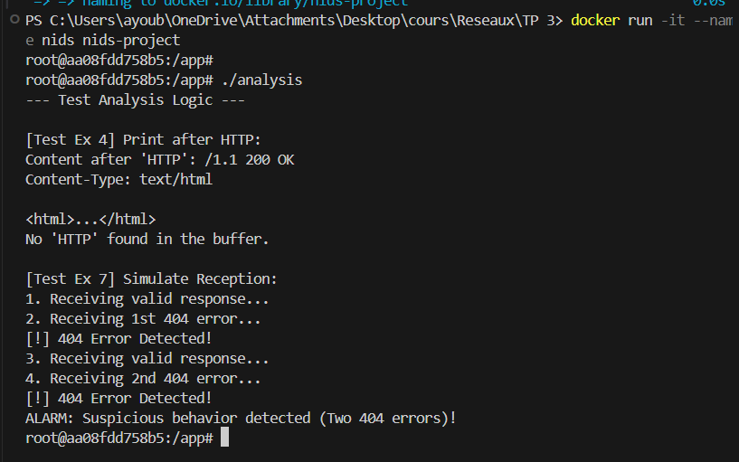

# Rapport - TP 3 : Système de Détection d'Intrusions

**Étudiant :** Ayoub Benayyad  
**Matière :** Administration Réseau

---

## Introduction

Dans ce TP, j'ai réalisé un petit outil de détection d'intrusions (NIDS) en C. Le but est de détecter quand quelqu'un génère trop d'erreurs 404 (pages non trouvées), ce qui peut être suspect (scan de vulnérabilités par exemple).

## 1. Analyse théorique

**Exercices 1, 2, 3**

Un NIDS surveille le réseau pour trouver des attaques. Pour l'analyse HTTP, j'ai vu que l'entête commence par "HTTP" (48 54 54 50 en hexadécimal).
J'ai créé des fonctions en C pour repérer ce mot-clé dans les paquets qu'on reçoit.

## 2. Logique du programme (Partie Analyse)

J'ai écrit le fichier `analysis.c` qui contient la logique de base sans la capture réseau.
Fonctions principales :
- `print_after_http` : Affiche le contenu après l'entête.
- `detectHttp404` : Cherche si on a "HTTP" et "404" dans le même paquet.
- `recv` : Simule la réception et compte les erreurs. Si on en a 2, ça sonne l'alarme.

**Résultat de l'exécution (`./analysis`) :**



## 3. Capture de paquets (Sniffer)

Pour la capture réelle, j'ai utilisé la librairie `libpcap` dans `sniffer.c`.
Le programme :
1. Cherche l'interface réseau (automatiquement ou via argument).
2. Configure un filtre `tcp src port 80` pour ne regarder que le trafic Web entrant.
3. Lance une boucle qui appelle ma fonction `callback` à chaque paquet.

Dans la fonction `callback`, je regarde si le paquet contient des données. Si oui, je vérifie si c'est une 404.

## 4. Tests et Résultats

J'ai testé mon programme avec `curl` car les navigateurs utilisent HTTPS maintenant et mon sniffer ne voit que le HTTP clair.

**Trace d'exécution :**

D'abord le sniffer s'initialise :
```
Périphérique trouvé : eth0
Net: 10.16.32.0
Mask: 255.255.240.0
Filtre 'tcp src port 80' appliqué.
Lancement de la capture...
```

**Test 1 : Trafic Normal**
J'ai lancé une requête valide (`curl http://example.com`).
```
[Paquet] Dest IP: 10.16.37.152 | Taille: 364 octets
--- Debut du contenu ---
HTTP/1.1 200 OK
Server: nginx
Date: Sun, 07 Dec 2025 01:37:23 GMT
Content-Type: text/html
...
------------------------
```
-> Tout est normal, pas d'alerte.

**Test 2 : Tentative d'intrusion (2 erreurs 404)**
J'ai lancé deux requêtes vers des pages qui n'existent pas.

*Première erreur :*
```
[Paquet] Dest IP: 10.16.37.152 | Taille: 970 octets
--- Debut du contenu ---
HTTP/1.1 404 Not Found
Date: Sun, 07 Dec 2025 16:37:40 GMT
...
ATTENTION : Erreur 404 détectée !
```

*Deuxième erreur :*
```
[Paquet] Dest IP: 10.16.37.152 | Taille: 970 octets
--- Debut du contenu ---
HTTP/1.1 404 Not Found
...
ATTENTION : Erreur 404 détectée !
!!! ALARME : Comportement suspect détecté (2 erreurs 404) !!!
```

On voit bien que l'alarme se déclenche au bout de la deuxième erreur comme demandé.

## Conclusion

Ce TP m'a permis de manipuler les sockets bruts indirectement via `libpcap`. J'ai compris comment on peut extraire des informations des paquets IP/TCP et comment implémenter une logique simple de surveillance. C'est la base de fonctionnement des outils comme Snort.
